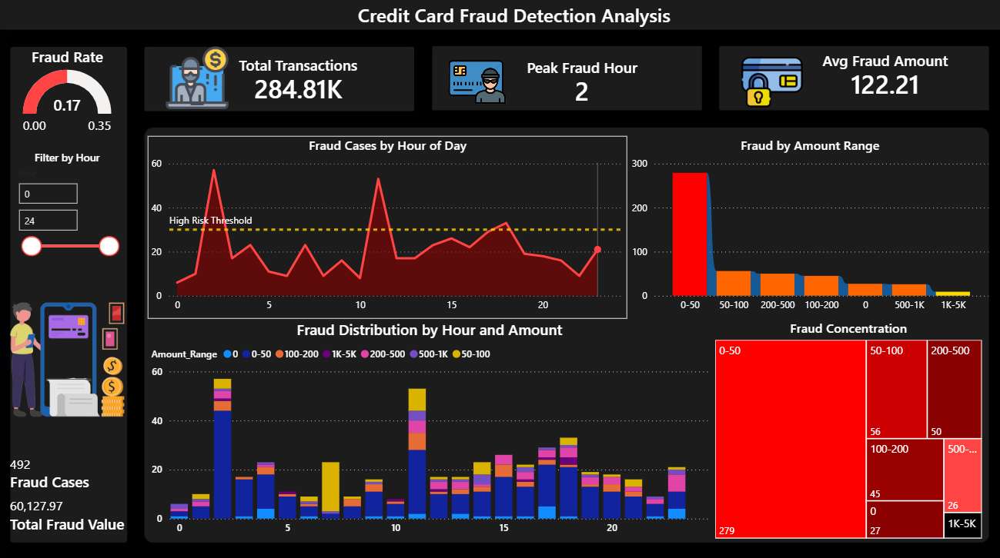

# Credit-Card-Fraud-Detection
Credit Card Fraud Detection Analysis using Python, SQL Server and Power BI on 284,807 transactions
# Credit Card Fraud Detection Analysis

## Overview
Analysed 284,807 real credit card transactions to detect 
fraud patterns using Python, SQL Server and Power BI.

## Key Findings
- **492 fraud cases** detected out of 284,807 transactions
- **Fraud rate: 0.173%** — highly imbalanced real-world dataset
- **Peak fraud hour: 2 AM** with 57 cases — lowest monitoring period
- **$0-50 range** accounts for 56% of all fraud cases (279 cases)
- **Avg fraud amount: $122.21** vs legitimate $88.29 (38% higher)
- **Total fraud value: $60,127.97**

## Business Recommendations
- Increase transaction monitoring during 2 AM and 11 AM windows
- Flag small transactions under $50 with unusual patterns for review
- Implement risk-based alerts for transactions above High Risk Threshold

## Tools Used
- Python (Pandas, NumPy, Matplotlib, Seaborn)
- SQL Server
- Power BI (Advanced Dashboard)

## Dashboard Preview

## Dataset
- Source: Kaggle UCI Credit Card Fraud Detection
- Total Records: 284,807 transactions
- Fraud Cases: 492 (0.173%)
- Features: 30 anonymized variables plus Amount and Class

## Project Structure
[CreditCard-Fraud-Detection/](https://github.com/sandeep-sandy123/Credit-Card-Fraud-Detection/blob/main/CreditCard-Fraud-Detection)
├── [Credit_Card_Fraud_Detection.ipynb](https://github.com/sandeep-sandy123/Credit-Card-Fraud-Detection/blob/main/Credit_Card_Fraud_Detection.ipynb)
├── creditcard_clean.csv
├── [dashboard.png](https://github.com/sandeep-sandy123/Credit-Card-Fraud-Detection/blob/main/dashboard.png)
└── README.md
